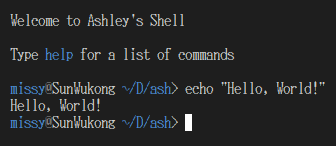
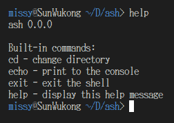

# Ashley's Shell

Ash is a shell designed for the Linux kernel written entirely in C.

Ash is currently in an early state of development, so it is missing many features, but the following are currently implemented:

- Advanced line editing (<kbd>HOME</kbd>, <kbd>END</kbd>, <kbd>Ctrl+Backspace</kbd>, etc)
- Script executioncd
- Session-based history
- Respects [NO_COLOR](https://no-color.org/)

# Installation

Ash does not require any particulars for installation. You can simply move the executable to `/usr/bin` and add it to `/etc/shells`.

It can be compiled using standard C, eg. `gcc ./src/main.c -O2 -o ash`.

# Licensing

Ash is licensed under the [GPL-3.0](https://github.com/FluxFlu/ash/blob/main/LICENSE). A copy is also included with the compiler.